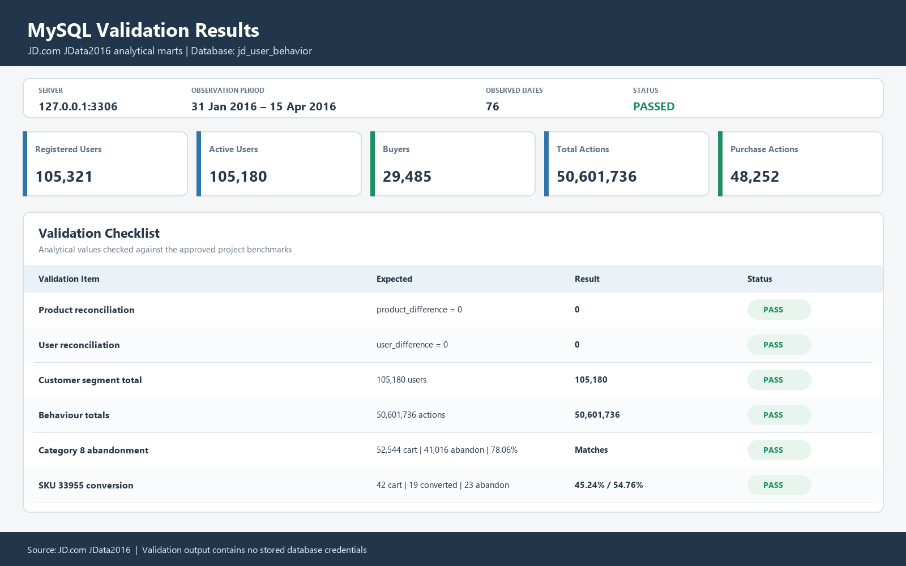
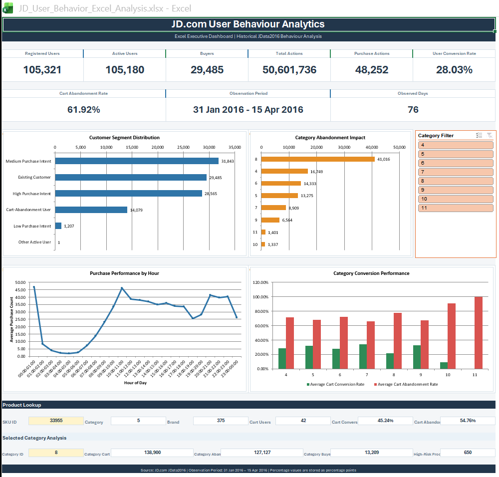
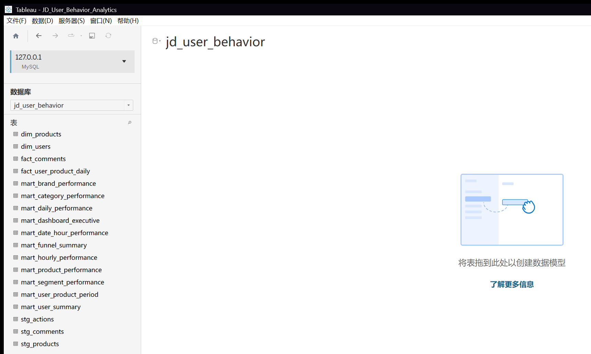

# JD.com User Behaviour Analytics

A portfolio-ready e-commerce analytics project built with **Python, MySQL, SQL, and Tableau**. The project analyses customer browsing, clicking, following, cart, and purchase behaviour from the JD.com JData2016 dataset.

The analysis focuses on four operational questions:

1. Where do users leave the purchase journey?
2. Which users show strong purchase intent?
3. Which products, categories, and brands create the largest cart-abandonment impact?
4. When should conversion and remarketing campaigns be launched?

---

## Project Summary

| Item | Result |
|---|---:|
| Observation period | 31 January 2016 – 15 April 2016 |
| Observed days | 76 |
| Registered users | 105,321 |
| Active users | 105,180 |
| Buyers | 29,485 |
| Total actions | 50,601,736 |
| Purchase actions | 48,252 |
| Dashboard pages | 4 |

The final analytical layer reconciles all **50,601,736 source actions** and all **105,180 active users** without unexplained differences.

---

## Business Problem

JD.com records millions of user interactions, but only a small proportion progress to purchase. Operations and marketing teams need a reliable way to identify:

- Major conversion drop-off points
- Users with high purchase intent
- Users who add products to cart but do not purchase
- High-interest, low-conversion products
- Categories and brands with severe cart abandonment
- Strong and weak campaign time windows
- Product-comment patterns associated with conversion performance

This project converts raw behavioural logs into structured analytical marts and interactive Tableau dashboards that support marketing, product, and operational decisions.

---

## Business Objectives

The project aims to:

- Measure the customer behaviour funnel
- Calculate strict user-product cart conversion
- Identify cart-abandonment users
- Segment users by purchase intent
- Compare product, category, and brand performance
- Analyse weekday and hourly purchasing patterns
- Review product-comment indicators
- Produce actionable business recommendations
- Build a reusable MySQL-to-Tableau analytics pipeline

---

## Dataset

Dataset: **JD.com JData2016**

Kaggle source:

https://www.kaggle.com/datasets/owincontext/jdata2016

The raw data is not included in this repository because the action files exceed 2 GB in total.

Expected source files:

```text
data/raw/
├── JData_User.csv
├── JData_Product.csv
├── JData_Comment.csv
├── JData_Action_201602.csv
├── JData_Action_201603.csv
└── JData_Action_201604.csv
```

### Source Tables

| File | Main Fields | Purpose |
|---|---|---|
| `JData_User.csv` | `user_id`, `age`, `sex`, `user_lv_cd`, `user_reg_tm` | User profile and membership analysis |
| `JData_Product.csv` | `sku_id`, `a1`, `a2`, `a3`, `cate`, `brand` | Product, category, and brand analysis |
| `JData_Comment.csv` | `dt`, `sku_id`, `comment_num`, `has_bad_comment`, `bad_comment_rate` | Product-comment snapshots |
| `JData_Action_*.csv` | `user_id`, `sku_id`, `time`, `model_id`, `type`, `cate`, `brand` | Customer behavioural events |

### Action-Type Mapping

| Type | Behaviour |
|---:|---|
| 1 | Browse |
| 2 | Add to cart |
| 3 | Remove from cart |
| 4 | Purchase |
| 5 | Follow |
| 6 | Click |

---

## Technology Stack

| Layer | Technology |
|---|---|
| Data inspection | Python, pandas |
| Database | MySQL |
| Data transformation | SQL |
| Data modelling | Dimension, fact, and analytical mart tables |
| Visualisation | Tableau Desktop |
| Spreadsheet analysis | Microsoft Excel, Power Query, PivotTables, PivotCharts |
| Documentation | Markdown |
| Version control | Git and GitHub |

Python dependencies are listed in `requirements.txt`.

---

## Repository Structure

```text
ecommerce-user-behavior-analytics/
├── README.md
├── business_requirement.md
├── requirements.txt
├── .gitignore
│
├── data/
│   ├── raw/                         # Not uploaded to GitHub
│   └── processed/                   # Optional processed files
│
├── scripts/
│   ├── 01_profile_raw_data.py
│   ├── 02_load_small_tables.py
│   └── 03_load_action_tables.py
│
├── sql/
│   ├── 01_create_staging_tables.sql
│   ├── 02_validate_staging_data.sql
│   ├── 03_create_dimension_tables.sql
│   ├── 04_create_daily_behavior_fact.sql
│   ├── 05_create_user_product_period_mart.sql
│   ├── 06_create_user_summary_mart.sql
│   ├── 07_validate_customer_segments.sql
│   ├── 08_create_product_performance_mart.sql
│   ├── 09_fix_product_cart_conversion.sql
│   ├── 10_create_category_performance_mart.sql
│   ├── 11_create_brand_performance_mart.sql
│   ├── 12_create_daily_performance_mart.sql
│   ├── 13_create_hourly_performance_mart.sql
│   ├── 14_create_dashboard_summary_marts.sql
│   ├── 15_data_quality_audit.sql
│   └── 16_business_analysis.sql
│
├── docs/
│   ├── data_dictionary.md
│   ├── data_cleaning_report.md
│   └── database_schema.md
│
├── reports/
│   └── business_findings.md
│
├── tableau/
│   ├── JD_User_Behavior_Analytics.twbx
│   └── README.md
│
└── screenshots/
    ├── 01_executive_overview.png
    ├── 02_user_behaviour_funnel.png
    ├── 03_product_performance.png
    ├── 04_customer_segmentation.png
    ├── 05_tableau_data_sources.png
    └── 06_mysql_validation_results.png
```

---

## Data Architecture

```text
Raw CSV Files
      ↓
Staging Tables
      ↓
Clean Dimension and Fact Tables
      ↓
Daily and Period-Level Behaviour Tables
      ↓
User, Product, Category, Brand, Daily and Hourly Marts
      ↓
Dashboard Summary Marts
      ↓
Tableau Dashboards
```

### Core Database Layers

#### Staging Layer

| Table | Grain |
|---|---|
| `stg_users` | One row per source user |
| `stg_products` | One row per source product |
| `stg_comments` | One row per product-comment snapshot date |
| `stg_actions` | One row per behavioural event |

#### Clean Analytical Layer

| Table | Grain |
|---|---|
| `dim_users` | One row per user |
| `dim_products` | One row per product |
| `fact_comments` | One row per product and comment date |
| `fact_user_product_daily` | One row per date, user, and product |

#### Analytical Marts

| Table | Grain | Main Use |
|---|---|---|
| `mart_user_product_period` | One row per user and product | Full-period cart conversion |
| `mart_user_summary` | One row per active user | Segmentation and marketing targets |
| `mart_product_performance` | One row per product | Product conversion and abandonment |
| `mart_category_performance` | One row per category | Category comparison |
| `mart_brand_performance` | One row per brand | Brand comparison |
| `mart_daily_performance` | One row per date | Daily and weekday analysis |
| `mart_hourly_performance` | One row per hour | Hourly campaign timing |
| `mart_dashboard_executive` | One row for the observation period | Executive KPIs |
| `mart_funnel_summary` | One row per funnel stage | Behavioural reach funnel |
| `mart_segment_performance` | One row per customer segment | Segment comparison |

---

## Data Profiling and Cleaning

### Encoding Handling

- `JData_User.csv` is read using `GBK`.
- Other source files are read using `UTF-8-SIG`.

### Data-Type Standardisation

- Decimal-form user IDs such as `266079.0` are converted to integer user IDs.
- Action timestamps are converted to `DATETIME`.
- Registration and comment dates are converted to `DATE`.
- Missing `model_id` values are retained as `NULL`.

### Unknown-Value Handling

- User age `-1` is converted to `Unknown`.
- Product attributes `a1`, `a2`, and `a3` with value `-1` are converted to `NULL`.
- Invalid or unsupported sex codes are converted to `NULL`.
- Missing user or product profiles do not automatically invalidate behavioural records.

### Duplicate Handling

- User IDs are checked for duplication.
- Product IDs are checked for duplication.
- Comment snapshots are checked using `comment_date + sku_id`.
- Repeated behavioural events are retained because repeated clicks and browsing events may represent valid user activity.

### Referential-Integrity Checks

The project checks:

- Active users without user profiles
- Registered users without recorded activity
- Active products without product profiles
- Commented products without product profiles
- Category mismatches
- Brand mismatches

Details are documented in `docs/data_cleaning_report.md`.

---

## Metric Definitions

### Active User

A user with at least one recorded action during the observation period.

### Buyer

A user with at least one purchase action.

### Behavioural Reach Funnel

The funnel reports users who performed each type of behaviour. Users may skip stages. A buyer may purchase without a recorded follow or cart-add event.

### Strict Cart Conversion

A converted cart user-product pair requires:

```text
Same user
+ same product
+ at least one cart-add action
+ at least one purchase action
```

### Cart-Abandonment Pair

A user added a product to cart but did not purchase that same product during the observation period.

### Purchase-Intent Score

The rule-based score considers browsing, clicking, following, cart additions, cart removals, purchases, and recency. It supports prioritisation and requires validation before production use.

---

## Data Validation

The final reconciliation result is:

| Validation Item | Result |
|---|---:|
| Source actions | 50,601,736 |
| Product-mart actions | 50,601,736 |
| Product difference | 0 |
| Active users | 105,180 |
| Segment users | 105,180 |
| User difference | 0 |

Behaviour totals:

| Behaviour | Count |
|---|---:|
| Browse | 18,981,373 |
| Add to cart | 575,418 |
| Remove from cart | 256,053 |
| Purchase | 48,252 |
| Follow | 109,896 |
| Click | 30,630,744 |
| **Total** | **50,601,736** |

Validation evidence:



---

## Customer Segmentation

| Segment | Users | Share |
|---|---:|---:|
| Medium Purchase Intent | 31,843 | 30.27% |
| Existing Customer | 29,485 | 28.03% |
| High Purchase Intent | 28,565 | 27.16% |
| Cart-Abandonment User | 14,079 | 13.39% |
| Low Purchase Intent | 1,207 | 1.15% |
| Other Active User | 1 | 0.00% |
| **Total** | **105,180** | **100.00%** |

### Segment Use Cases

| Segment | Recommended Action |
|---|---|
| Existing Customer | Cross-sell, membership, and retention campaigns |
| High Purchase Intent | Limited-time coupons and personalised reminders |
| Cart-Abandonment User | Cart reminders, discounts, and stock alerts |
| Medium Purchase Intent | Product recommendations and follow-up campaigns |
| Low Purchase Intent | Awareness and discovery campaigns |
| Other Active User | Review unusual behaviour |

---

## Key Business Findings

### 1. Platform activity is dominated by discovery behaviour

Clicks and browsing represent most recorded actions. Purchase events form a very small share of total activity, showing a large gap between interest and completed purchase.

### 2. High-intent and cart-abandonment users are the primary campaign targets

- High Purchase Intent: 28,565 users
- Cart-Abandonment User: 14,079 users

These users already demonstrate meaningful behavioural intent and should receive priority over low-engagement users.

### 3. Category 8 creates the largest abandonment impact

Category 8 recorded:

- 52,544 cart users
- 11,528 converted cart users
- 41,016 abandoned cart users
- 78.06% cart abandonment

The high affected-user volume makes Category 8 the highest operational priority.

### 4. Categories 10 and 11 show severe conversion weakness

- Category 11: 100.00% strict cart abandonment
- Category 10: 90.71% strict cart abandonment

These categories require investigation into product availability, delivery, product information, trust, pricing, and checkout friction.

### 5. Category 7 has the strongest relative cart conversion

Category 7 achieved approximately 34.24% strict cart conversion, making it a useful internal benchmark.

### 6. Brand risk should be prioritised by both rate and volume

Some brands have extremely high abandonment rates, while brands such as 200 and 752 affect larger numbers of cart users.

### 7. Even the stronger products lose more than half of cart users

| SKU | Cart Conversion | Cart Abandonment |
|---:|---:|---:|
| 33955 | 45.24% | 54.76% |
| 80130 | 44.00% | 56.00% |
| 126831 | 43.40% | 56.60% |
| 145705 | 43.15% | 56.85% |
| 160485 | 40.00% | 60.00% |

### 8. Tuesday is the strongest weekday

Tuesday recorded the highest average purchase activity and active-user conversion rate.

### 9. Sunday is the weakest weekday

Sunday recorded the lowest average active users, lowest purchase activity, lowest conversion, and highest same-day cart abandonment.

### 10. Midnight and late morning are strong conversion windows

- 00:00–01:00 produced the highest average purchase count.
- 10:00–11:00 was another strong period.
- 20:00–23:00 had high traffic but weaker purchase efficiency.

Detailed findings are available in `reports/business_findings.md`.

---

## Business Recommendations

### Recover Cart-Abandonment Users

Target cart-abandonment users with product-specific reminders, limited-time discounts, stock alerts, delivery reassurance, and alternative-product recommendations.

### Convert High-Intent Users Quickly

Use recent activity and purchase-intent scores to trigger personalised recommendations, followed-product notifications, cart reminders, membership incentives, and time-limited offers.

### Prioritise High-Impact Categories and Brands

Review categories and brands using both cart-abandonment rate and the number of affected cart users.

### Improve Category 8

A small conversion improvement in Category 8 could affect a large customer population because it contains 41,016 abandoned cart users.

### Investigate Categories 10 and 11

Potential review areas include stock availability, delivery fees, fulfilment speed, product-page completeness, trust signals, price competitiveness, checkout friction, and alternative-product switching.

### Optimise Campaign Timing

- Use Tuesday and Thursday for purchase-focused campaigns.
- Use 00:00–01:00 and 10:00–11:00 for direct conversion offers.
- Use 20:00–23:00 for recommendations, retargeting, and cart reminders.
- Use weekends for re-engagement and cart recovery.

### Validate Recommendations with Experiments

Recommended tests include coupon versus no-coupon, cart-reminder timing, product-page improvements, delivery-message variants, category-specific campaigns, and purchase-intent threshold validation.

---

## Tableau Dashboards

The Tableau workbook contains four dashboard pages.

### 1. Executive Overview

Main components:

- Registered Users
- Active Users
- Buyers
- Total Actions
- Purchase Actions
- User Conversion Rate
- Cart Abandonment Rate
- Daily activity and purchase trends
- Weekday conversion performance


### 2. User Behaviour Funnel

Main components:

- Behavioural reach funnel
- Active, interested, followed, cart, and buyer stages
- Cart conversion and abandonment
- Customer-segment distribution
- Funnel interpretation note


### 3. Product, Category and Brand Performance

Main components:

- Category conversion performance
- Category abandonment impact
- Brand abandonment risk
- Product conversion leaders
- Product abandonment impact


### 4. Customer Segmentation and Marketing Targets

Main components:

- Customer-segment size and share
- Segment behaviour comparison
- High-intent and cart-abandonment user table
- Marketing-action recommendations
- Recommended campaign hours


---

## Excel Analysis

The Excel portfolio workbook complements Tableau with an auditable, refreshable spreadsheet reporting layer. It demonstrates:

- Executive KPI reporting
- Customer-segment analysis
- Category conversion and abandonment analysis
- Hourly purchase analysis
- Product XLOOKUP
- SUMIFS and COUNTIFS category analysis
- Native PivotTables and PivotCharts
- A connected category slicer
- Conditional formatting and structured-reference formula columns

Workbook: [`excel/JD_User_Behavior_Excel_Analysis.xlsx`](excel/JD_User_Behavior_Excel_Analysis.xlsx)



---

## Technical Evidence

### Tableau Data Sources

The workbook uses separate Tableau data sources because the analytical marts have different grains.



### MySQL Validation

The final validation confirms that all actions and active users are reconciled.


---

## Tableau Data Sources

| Tableau Data Source | MySQL Table |
|---|---|
| Executive KPI | `mart_dashboard_executive` |
| User Funnel | `mart_funnel_summary` |
| Customer Segments | `mart_segment_performance` |
| Daily Performance | `mart_daily_performance` |
| Hourly Performance | `mart_hourly_performance` |
| Category Performance | `mart_category_performance` |
| Brand Performance | `mart_brand_performance` |
| Product Performance | `mart_product_performance` |
| User Detail | `mart_user_summary` |

Large staging and intermediate tables are not connected directly to Tableau.

---

## How to Run the Project

### 1. Clone the Repository

```powershell
git clone <your-repository-url>
cd ecommerce-user-behavior-analytics
```

### 2. Create the Raw-Data Folder

```powershell
New-Item -ItemType Directory -Force data\raw
```

Place the six downloaded JData2016 CSV files in `data/raw/`.

### 3. Install Python Dependencies

```powershell
python -m pip install -r requirements.txt
```

### 4. Create the Environment File

Create a `.env` file in the project root:

```env
DB_HOST=127.0.0.1
DB_PORT=3306
DB_USER=root
DB_PASSWORD=YOUR_MYSQL_PASSWORD
DB_NAME=jd_user_behavior
```

Do not commit `.env` to GitHub.

### 5. Profile the Raw Data

```powershell
python scripts\01_profile_raw_data.py
```

### 6. Create the Database and Staging Tables

Run in MySQL Workbench:

```text
sql/01_create_staging_tables.sql
```

### 7. Load Users, Products, and Comments

```powershell
python scripts\02_load_small_tables.py
```

### 8. Load the Action Files

```powershell
python scripts\03_load_action_tables.py
```

### 9. Run the SQL Pipeline in Order

```text
sql/02_validate_staging_data.sql
sql/03_create_dimension_tables.sql
sql/04_create_daily_behavior_fact.sql
sql/05_create_user_product_period_mart.sql
sql/06_create_user_summary_mart.sql
sql/07_validate_customer_segments.sql
sql/08_create_product_performance_mart.sql
sql/09_fix_product_cart_conversion.sql
sql/10_create_category_performance_mart.sql
sql/11_create_brand_performance_mart.sql
sql/12_create_daily_performance_mart.sql
sql/13_create_hourly_performance_mart.sql
sql/14_create_dashboard_summary_marts.sql
sql/15_data_quality_audit.sql
sql/16_business_analysis.sql
```

For long-running queries in MySQL Workbench, set:

```text
Edit
→ Preferences
→ SQL Editor
→ DBMS connection read timeout interval
→ 0
```

Reconnect after changing the setting.

### 10. Open the Tableau Workbook

```text
tableau/JD_User_Behavior_Analytics.twbx
```

Refresh extracts when required.

---

## Security and Version-Control Notes

Do not upload:

- `.env`
- MySQL passwords
- Raw JData CSV files
- Database backups containing credentials
- Temporary logs
- Python cache files

Recommended `.gitignore` entries:

```gitignore
.env
__pycache__/
*.pyc
.vscode/

data/raw/
data/processed/

*.hyper
*.log
```

A packaged Tableau workbook may be large. When it exceeds the GitHub file limit, store it externally and include an access link in this README.

---

## Limitations

- The data covers historical behaviour from 2016.
- User, product, category, and brand identifiers are anonymised.
- Product price and revenue are unavailable.
- A purchase event may not represent final payment, delivery, cancellation, or return outcomes.
- Users may skip funnel stages.
- January and April contain partial observation periods.
- Same-day and same-hour cart metrics use strict time boundaries.
- Product-comment analysis is descriptive and does not establish causality.
- The purchase-intent score is rule-based.
- Direct purchases may cause buyer counts to exceed strict cart-converted-user counts.

---

## Project Deliverables

- Business requirements
- Python ingestion scripts
- MySQL data model
- SQL transformation pipeline
- Data-quality audit
- Business-analysis queries
- Business-findings report
- Tableau packaged workbook
- Excel analytical workbook
- Dashboard screenshots
- Technical validation evidence

---

## Conclusion

The project demonstrates an end-to-end e-commerce analytics workflow from raw behavioural logs to business-facing dashboards.

The analysis identifies clear opportunities in cart recovery, high-intent-user conversion, category and brand optimisation, and campaign timing. The database and dashboard outputs are fully reconciled against the original **50,601,736 behavioural events** and **105,180 active users**.
