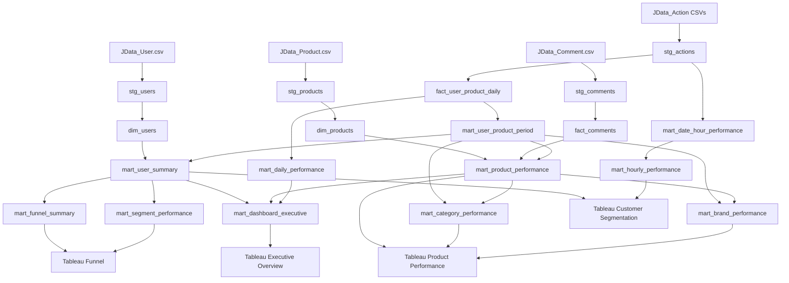

# Database Schema

## 1. Purpose

This document describes the MySQL architecture, table grains, keys, relationships, indexes, and transformation flow used in the JD.com User Behaviour Analytics project.

The schema is designed for:

- Large behavioural-log ingestion
- Reproducible data cleaning
- Efficient SQL analysis
- Tableau dashboard performance
- Clear separation between raw, clean, and analytical layers

---

## 2. Architecture Overview

```text
Raw CSV Files
      ↓
Staging Layer
      ↓
Clean Dimension and Fact Layer
      ↓
Behaviour Aggregation Layer
      ↓
Business Analytical Marts
      ↓
Dashboard Summary Marts
      ↓
Tableau Dashboards
```

### Layer Summary

| Layer | Purpose |
|---|---|
| Raw files | Original JData2016 CSV files |
| Staging | Source-aligned ingestion and validation |
| Dimension/fact | Clean reusable entities and daily facts |
| Behaviour aggregation | User-product period and time aggregation |
| Analytical marts | User, product, category, brand, daily, and hourly analysis |
| Dashboard marts | Compact Tableau-ready KPI, funnel, and segment tables |

---

## 3. Logical Schema Diagram



---

## 4. Staging Layer

### 4.1 `stg_users`

Grain: one source user.

Key business field:

```text
user_id
```

The staging table does not enforce a primary key during ingestion. Uniqueness is validated before building `dim_users`.

---

### 4.2 `stg_products`

Grain: one source product.

Key business field:

```text
sku_id
```

The staging table preserves source unknown values such as `-1`.

---

### 4.3 `stg_comments`

Grain: one product-comment snapshot per date.

Logical key:

```text
comment_date + sku_id
```

Uniqueness is validated before loading `fact_comments`.

---

### 4.4 `stg_actions`

Grain: one recorded user action.

The table stores all three monthly action files in one structure.

Key fields:

- `user_id`
- `sku_id`
- `action_time`
- `action_type`
- `cate`
- `brand`

No primary key is created because the source does not provide a unique event identifier.

Validated row count:

```text
50,601,736
```

---

## 5. Dimension and Fact Layer

### 5.1 `dim_users`

Primary key:

```text
user_id
```

Logical relationship:

```text
dim_users.user_id
→ fact_user_product_daily.user_id
→ mart_user_product_period.user_id
→ mart_user_summary.user_id
```

The relationship is logical. Physical foreign-key constraints are not required for the project pipeline because:

- Large bulk loads are faster without constraint checking.
- Some behavioural records may not have complete profile data.
- Missing profiles are retained as valid behavioural activity.

---

### 5.2 `dim_products`

Primary key:

```text
sku_id
```

Logical relationships:

```text
dim_products.sku_id
→ fact_user_product_daily.sku_id
→ mart_user_product_period.sku_id
→ mart_product_performance.sku_id
```

Additional descriptive relationships:

```text
dim_products.category_id
→ mart_category_performance.category_id

dim_products.brand_id
→ mart_brand_performance.brand_id
```

---

### 5.3 `fact_comments`

Primary key:

```text
comment_date + sku_id
```

Logical relationship:

```text
fact_comments.sku_id
→ dim_products.sku_id
→ mart_product_performance.sku_id
```

The product mart uses the latest available comment snapshot.

---

### 5.4 `fact_user_product_daily`

Primary key:

```text
action_date + user_id + sku_id
```

Grain:

```text
one date
+ one user
+ one product
```

This table compresses the source event table by aggregating repeated daily behaviour.

It is the main reusable fact table for:

- Daily activity
- User-product aggregation
- User summary
- Product summary
- Category summary
- Brand summary

---

## 6. Behaviour Aggregation Layer

### 6.1 `mart_user_product_period`

Primary key:

```text
user_id + sku_id
```

Grain:

```text
one user
+ one product
+ complete observation period
```

This is the central conversion table.

It supports:

- Product-level interest
- Cart-add status
- Purchase status
- Strict cart conversion
- Cart abandonment
- User segmentation

Logical relationships:

```text
mart_user_product_period.user_id
→ dim_users.user_id

mart_user_product_period.sku_id
→ dim_products.sku_id
```

---

### 6.2 `mart_date_hour_performance`

Primary key:

```text
action_date + hour_of_day
```

Grain:

```text
one date
+ one hour
```

This table is produced from temporary hourly user-product and user-level aggregation tables.

Temporary processing tables:

- `work_user_product_hourly`
- `work_user_hourly`

These are deleted at the end of the hourly-build script.

---

## 7. Analytical Marts

### 7.1 `mart_user_summary`

Primary key:

```text
user_id
```

Grain:

```text
one active user
```

Inputs:

- `fact_user_product_daily`
- `mart_user_product_period`
- `dim_users`

Outputs:

- User behaviour totals
- Recency
- Product counts
- Cart-abandonment counts
- Purchase-intent score
- Customer segment

---

### 7.2 `mart_product_performance`

Primary key:

```text
sku_id
```

Grain:

```text
one active product
```

Inputs:

- `mart_user_product_period`
- `dim_products`
- Latest snapshot from `fact_comments`

Key conversion identity:

```text
cart_users
=
cart_converted_users
+
cart_abandon_users
```

---

### 7.3 `mart_category_performance`

Primary key:

```text
category_id
```

Grain:

```text
one active category
```

Inputs:

- `mart_user_product_period`
- `mart_product_performance`

This table recalculates distinct user metrics at the category level instead of summing product-level user counts. This prevents double counting users who interact with multiple products in the same category.

---

### 7.4 `mart_brand_performance`

Primary key:

```text
brand_id
```

Grain:

```text
one active brand
```

Inputs:

- `mart_user_product_period`
- `mart_product_performance`

This table recalculates distinct brand-level user metrics to prevent duplicated user counts across products.

---

### 7.5 `mart_daily_performance`

Primary key:

```text
action_date
```

Grain:

```text
one calendar date
```

Inputs:

- `fact_user_product_daily`

Uses:

- Daily trends
- Weekday comparison
- Same-day cart conversion
- Active-user conversion

---

### 7.6 `mart_hourly_performance`

Primary key:

```text
hour_of_day
```

Grain:

```text
one hour of day
```

Input:

- `mart_date_hour_performance`

Uses:

- Peak purchase hours
- Purchase share
- Hourly traffic
- Same-hour cart conversion

---

## 8. Dashboard Summary Marts

### 8.1 `mart_dashboard_executive`

Primary key:

```text
snapshot_id
```

Grain:

```text
one full-period snapshot
```

Inputs:

- `dim_users`
- `mart_user_summary`
- `mart_product_performance`
- `mart_daily_performance`
- `mart_user_product_period`

Used by:

```text
Tableau Executive KPI data source
```

---

### 8.2 `mart_funnel_summary`

Primary key:

```text
stage_order
```

Unique key:

```text
stage_name
```

Grain:

```text
one behavioural reach stage
```

Input:

- `mart_user_summary`

Used by:

```text
Tableau User Funnel data source
```

---

### 8.3 `mart_segment_performance`

Primary key:

```text
customer_segment
```

Grain:

```text
one customer segment
```

Input:

- `mart_user_summary`

Used by:

```text
Tableau Customer Segments data source
```

---

## 9. Key Indexes

### `dim_users`

- Primary key on `user_id`
- Index on `user_level`
- Index on `registration_date`

### `dim_products`

- Primary key on `sku_id`
- Index on `category_id`
- Index on `brand_id`

### `fact_comments`

- Primary key on `(comment_date, sku_id)`
- Index on `sku_id`
- Index on `bad_comment_rate`

### `fact_user_product_daily`

- Primary key on `(action_date, user_id, sku_id)`
- Index on `(user_id, action_date)`
- Index on `(sku_id, action_date)`
- Index on `(category_id, action_date)`
- Index on `(brand_id, action_date)`

### `mart_user_product_period`

- Primary key on `(user_id, sku_id)`
- Index on `sku_id`
- Index on `category_id`
- Index on `brand_id`
- Index on `purchase_flag`
- Index on `cart_abandon_flag`

### `mart_user_summary`

- Primary key on `user_id`
- Index on `customer_segment`
- Index on `user_level`
- Index on `purchase_intent_score`
- Index on `buyer_flag`
- Index on `cart_abandon_flag`

### `mart_product_performance`

- Primary key on `sku_id`
- Index on `category_id`
- Index on `brand_id`
- Index on `buyers`
- Index on `cart_abandonment_rate`

### `mart_category_performance`

- Primary key on `category_id`
- Index on cart conversion
- Index on cart abandonment
- Index on buyers

### `mart_brand_performance`

- Primary key on `brand_id`
- Index on cart conversion
- Index on cart abandonment
- Index on buyers

### `mart_daily_performance`

- Primary key on `action_date`
- Index on `month_start_date`
- Index on `day_of_week_number`

### `mart_hourly_performance`

- Primary key on `hour_of_day`

---

## 10. Why Foreign Keys Are Not Physically Enforced

The schema uses logical relationships rather than physical foreign-key constraints for the main analytical pipeline.

Reasons:

1. `stg_actions` contains more than 50 million rows.
2. Bulk loading is faster without foreign-key validation.
3. Behavioural records may exist without complete user or product profiles.
4. The project deliberately retains valid behavioural activity even when reference data is incomplete.
5. Referential integrity is measured through audit queries instead of enforced deletion.

This design is suitable for an analytical warehouse-style workflow.

---

## 11. Tableau Data-Source Mapping

Each Tableau data source uses one analytical table.

| Tableau Data Source | MySQL Table | Grain |
|---|---|---|
| Executive KPI | `mart_dashboard_executive` | One full-period snapshot |
| User Funnel | `mart_funnel_summary` | One funnel stage |
| Customer Segments | `mart_segment_performance` | One customer segment |
| Daily Performance | `mart_daily_performance` | One date |
| Hourly Performance | `mart_hourly_performance` | One hour |
| Category Performance | `mart_category_performance` | One category |
| Brand Performance | `mart_brand_performance` | One brand |
| Product Performance | `mart_product_performance` | One product |
| User Detail | `mart_user_summary` | One active user |

The tables are intentionally connected as separate Tableau data sources.

They are not joined into one Tableau model because their grains differ. Joining them directly could multiply user, product, action, and KPI values.

---

## 12. SQL Pipeline Order

Run the scripts in this order:

```text
01_create_staging_tables.sql
02_validate_staging_data.sql
03_create_dimension_tables.sql
04_create_daily_behavior_fact.sql
05_create_user_product_period_mart.sql
06_create_user_summary_mart.sql
07_validate_customer_segments.sql
08_create_product_performance_mart.sql
09_fix_product_cart_conversion.sql
10_create_category_performance_mart.sql
11_create_brand_performance_mart.sql
12_create_daily_performance_mart.sql
13_create_hourly_performance_mart.sql
14_create_dashboard_summary_marts.sql
15_data_quality_audit.sql
16_business_analysis.sql
```

Python ingestion scripts run before the analytical SQL pipeline:

```text
01_profile_raw_data.py
02_load_small_tables.py
03_load_action_tables.py
```

---

## 13. Reconciliation Rules

The schema is validated using these identities.

### Action Reconciliation

Every action-based analytical layer must reconstruct:

```text
50,601,736
```

### Product Cart Consistency

For every product:

```text
cart_users
=
cart_converted_users
+
cart_abandon_users
```

### User Segmentation Consistency

```text
active_users
=
sum of segment users
```

Validated result:

```text
105,180 = 105,180
```

### Final Validation

| Metric | Value |
|---|---:|
| Source actions | 50,601,736 |
| Product-mart actions | 50,601,736 |
| Product difference | 0 |
| Active users | 105,180 |
| Segment users | 105,180 |
| User difference | 0 |

---

## 14. Design Considerations

### Large-Table Handling

- Action CSV files are loaded using `LOAD DATA LOCAL INFILE`.
- Indexes are added after large inserts where practical.
- The source action table is not connected directly to Tableau.
- Behaviour is aggregated before business analysis.

### Grain Control

Distinct-user metrics are recalculated at the required level.

Examples:

- Product users are calculated by product.
- Category users are recalculated by user-category.
- Brand users are recalculated by user-brand.
- Daily users are recalculated by user-date.
- Hourly users are recalculated by user-date-hour.

This avoids double counting caused by summing distinct users from lower-level tables.

### Historical Snapshot

The project analyses a fixed historical period. Tableau extracts are appropriate because the source data does not require live operational refresh.

---

## 15. Conclusion

The database schema separates raw ingestion, data cleaning, reusable facts, business marts, and dashboard outputs.

The design:

- Handles more than 50 million action rows
- Preserves valid behaviour
- Controls analytical grain
- Prevents metric duplication
- Supports reproducible SQL analysis
- Provides efficient Tableau data sources
