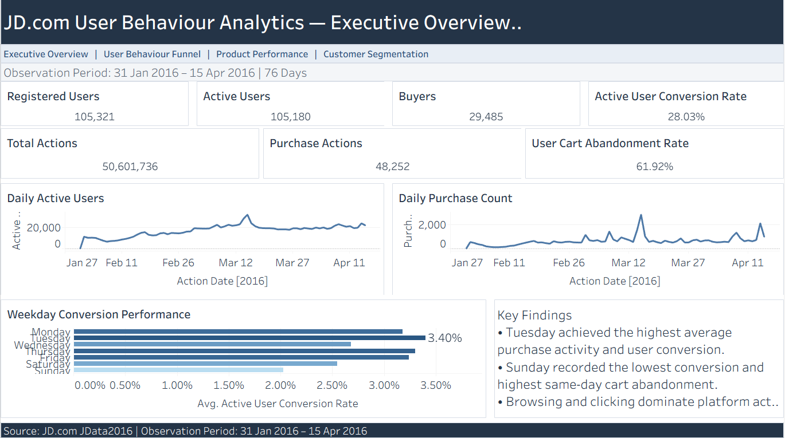
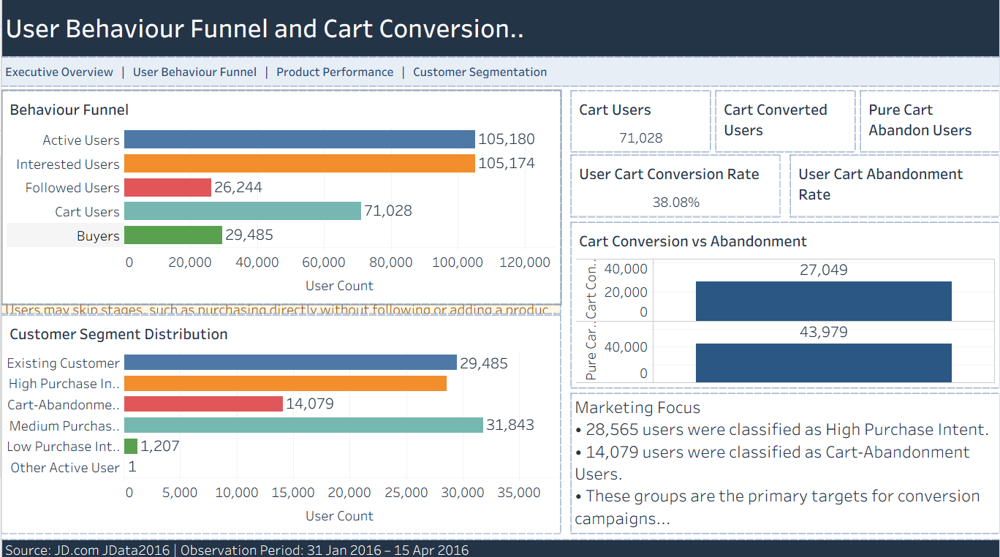
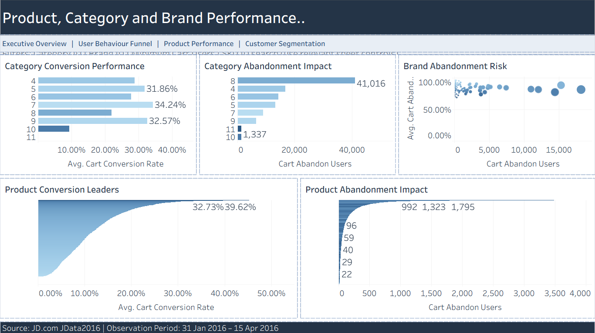
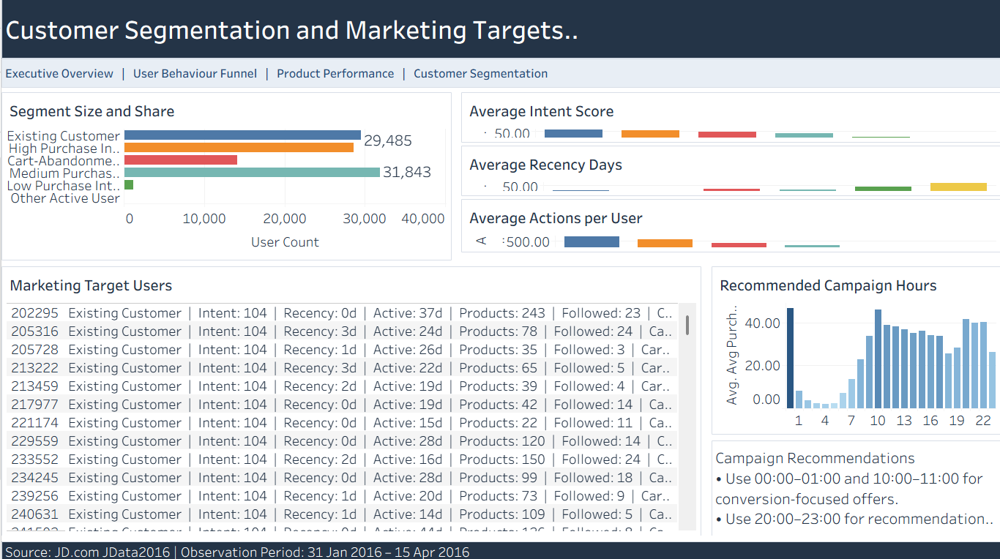

# Tableau Dashboard

## Workbook

`JD_User_Behavior_Analytics.twbx`

## Dashboard Pages

### 1. Executive Overview

Displays registered users, active users, buyers, total actions, purchase actions, conversion rate, cart abandonment rate, daily trends, and weekday performance.

### 2. User Behaviour Funnel

Displays the behavioural reach funnel, cart conversion, cart abandonment, and customer segment distribution.

Users may skip funnel stages, such as purchasing directly without following or adding a product to cart.

### 3. Product, Category and Brand Performance

Displays category conversion, category abandonment impact, brand risk, product conversion leaders, and products with severe cart abandonment.

### 4. Customer Segmentation and Marketing Targets

Displays customer segment size, behaviour characteristics, marketing target users, recommended actions, and campaign timing.

## Tableau Data Sources

| Tableau Data Source | MySQL Table |
|---|---|
| Executive KPI | `mart_dashboard_executive` |
| User Funnel | `mart_funnel_summary` |
| Customer Segments | `mart_segment_performance` |
| Daily Performance | `mart_daily_performance` |
| Hourly Performance | `mart_hourly_performance` |
| Category Performance | `mart_category_performance` |
| Brand Performance | `mart_brand_performance` |
| Product Performance | `mart_product_performance` |
| User Detail | `mart_user_summary` |

Each analytical table is connected as a separate Tableau data source because the tables have different grains.

## Dashboard Screenshots

### Executive Overview

### User Behaviour Funnel

### Product Performance

### Customer Segmentation

## Refresh Instructions

1. Start the local MySQL Server.
2. Open `JD_User_Behavior_Analytics.twbx`.
3. Confirm the MySQL connection:
   - Server: `127.0.0.1`
   - Port: `3306`
   - Database: `jd_user_behavior`
4. Select `Data`.
5. Choose the required data source.
6. Select `Extract` and then `Refresh`.

Database passwords are not stored in the project repository.

## Metric Notes

- Percentage values are already stored as percentage numbers in MySQL.
- Strict cart conversion requires the same user to add and purchase the same product.
- Same-day and same-hour cart metrics should not be interpreted as full-period cart conversion.
- Users may skip stages in the behavioural funnel.

## Limitations

- The data covers a historical period in 2016.
- Product and user identifiers are anonymised.
- Revenue and product prices are unavailable.
- The purchase-intent score is rule-based.